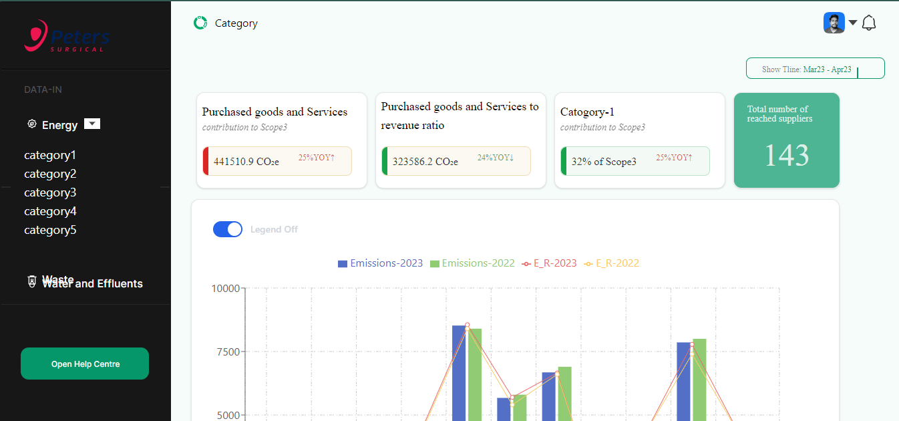
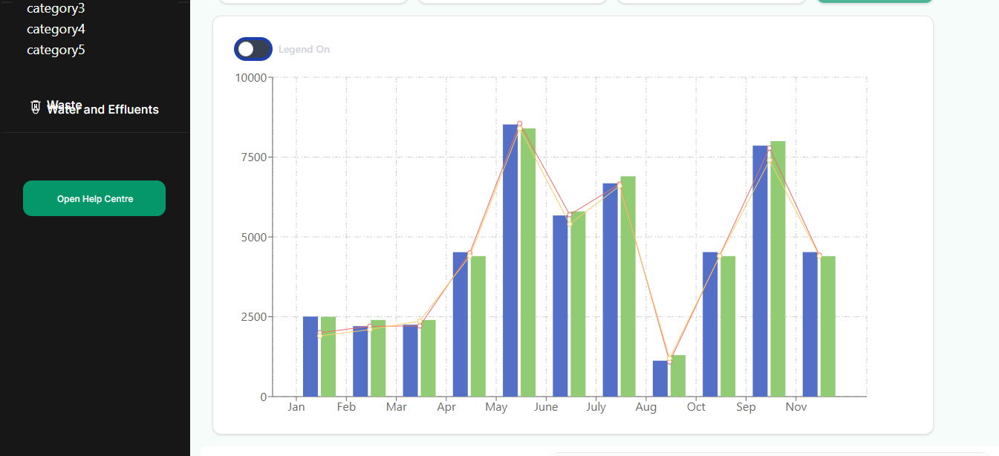
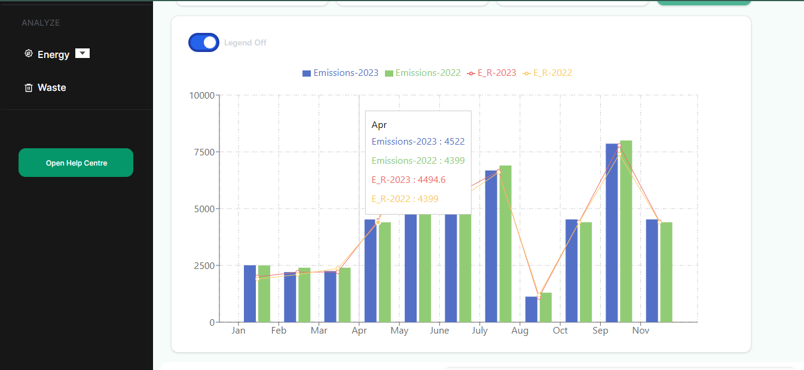
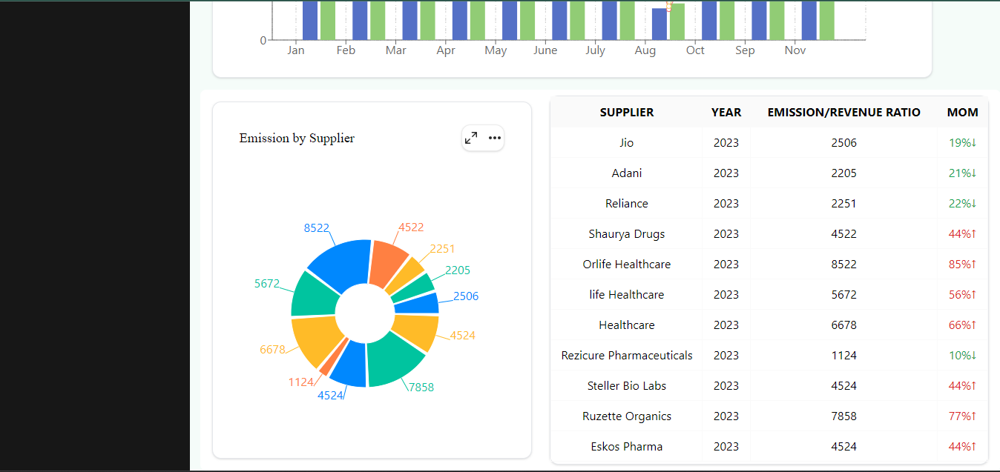
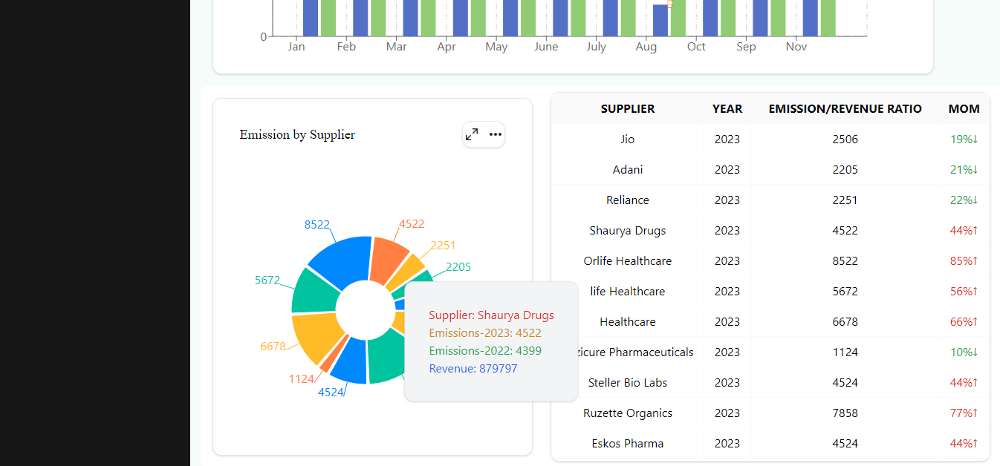

# GreenMentor Dashboard Assignment
 `This is a Single page Simple Dashboard UI`

## Tech Stack
 - React
 - ReChart
 - TailwindCss
 - Vite
  
## we use this topic in this project
 - props 
 - state
 - chart in react
 - reuse component
 - map() 
  
## Functionality
 - Sidebar with drop-down menu
 - BarChart legend on/off with toggle
 - EMO Data show red when increase else show green color
 - PieChart dynamic tooltip show when you hover
 - dynamic data add in all chart and table

## ScreenShot
 
 
 
 
 
 
